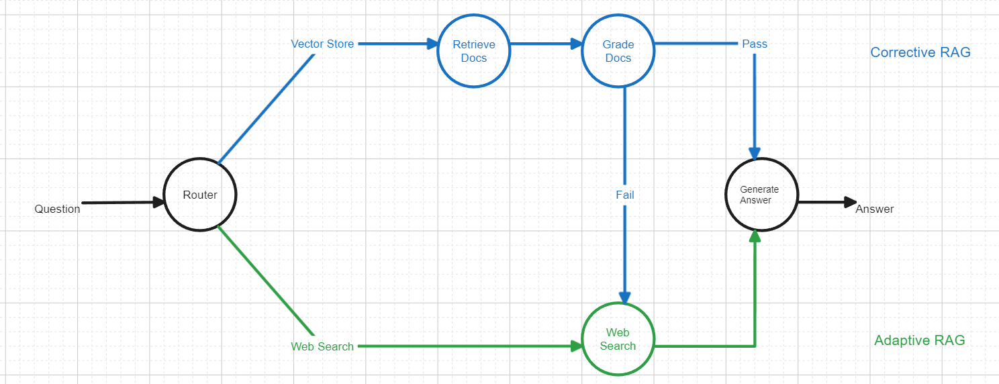

# Local RAG agent with LLaMA3
### Motivation
Objective is to implement a local RAG system powered by Llama3 8b with simple yet effective enhancements that make the RAG adaptive and corrective.

- Routing: Adaptive RAG [paper](https://arxiv.org/abs/2403.14403). Route questions to different retrieval approaches
- Fallback: Corrective RAG [paper](https://arxiv.org/pdf/2401.15884.pdf). Fallback to web search if docs are not relevant to query

